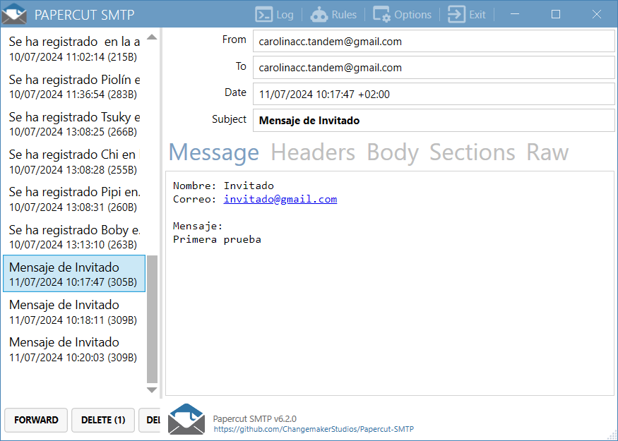

# CONTACTO FORMULARIO
Una API  escrita en PHP que permite enviar correos a un administrador
## Descripción
Este script PHP del lado del servidor permite procesar un formulario de contacto y enviar los datos a un correo electrónico especificado. Se puede utilizar para implementar un formulario de contacto en un sitio web o aplicación web.

### Instalación
Para su instalación deberá seguir los siguientes pasos:
1. **Copiar el código:** Descargue el código PHP del script y guárdelo en un archivo en su servidor. 

    O también puedes clonar el repositorio de [Github](https://github.com/carolinacc2323/api-sendemail).
2. **Configuración del correo electrónico:** Abra el archivo PHP y edite la variable $webmaster_email para reemplazarla con la dirección de correo electrónico del webmaster donde desea recibir los mensajes del formulario de contacto.
3. **Implementar en su sitio web o aplicación:** Incluya el archivo PHP en su sitio web o aplicación web en la página donde desea que aparezca el formulario de .

### Uso
- **Endpoint:** El script espera recibir una solicitud POST a la URL donde se encuentra el archivo PHP.

- **Parámetros:** Los datos del formulario de contacto se envían en el cuerpo de la solicitud en formato JSON. Los parámetros JSON esperados son:second

### Ejemplo de solicitud
```php
Envía una solicitud POST al script con el siguiente formato JSON:

POST    http://TU_DOMINIO/
Content-Type: "application/json"
{
    "name": "nombre",
    "email": "email@example.com",
    "message": "Tu mensaje" 
}
```

```php

Prueba de correo exitoso, con todos los datos completos

POST    http://TU_DOMINIO/
Content-Type: "application/json"

{
    "name": "Invitado",
    "email": "invitado@gmail.com",
    "message": "Prueba" 
}
```

```php
Prueba de correo un dato faltante

POST    http://TU_DOMINIO/
Content-Type: "application/json"

{
    "name": "Invitado",
    "email": "",
    "message": "Primera prueba" 
}
```

```php
Prueba de correo con email erróneo 
POST    http://TU_DOMINIO/
Content-Type: "application/json"

{
    "name": "Invitado",
    "email": "invitadogmail.com",
    "message": "Segunda prueba" 
}
```

```php
Prueba de correo con todos los datos faltantes 
POST    http://TU_DOMINIO/
Content-Type: "application/json"

{
    "name": "",
    "email": "",
    "message": "" 
}
```

### Ejemplo del correo enviado
